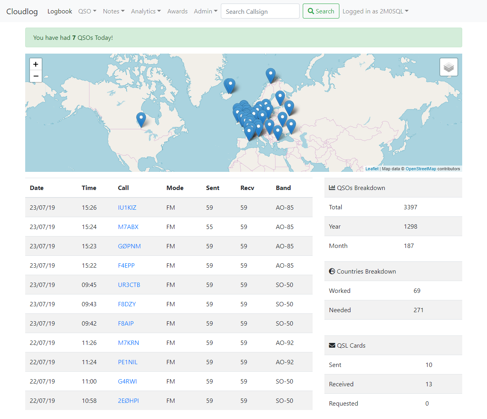

<!--
N.B.: This README was automatically generated by https://github.com/YunoHost/apps/tree/master/tools/readme_generator
It shall NOT be edited by hand.
-->

# CloudLog for YunoHost

[](https://dash.yunohost.org/appci/app/cloudlog)  

[](https://install-app.yunohost.org/?app=cloudlog)

*[Lire ce readme en français.](./README_fr.md)*

> *This package allows you to install CloudLog quickly and simply on a YunoHost server.
If you don't have YunoHost, please consult [the guide](https://yunohost.org/#/install) to learn how to install it.*

## Overview

Cloudlog is an open-source PHP & MySQL based amateur radio logging application, allowing you to log contacts via a web browser on any device and platform.

This is an ideal general-purpose logging application, supporting HF to Microwave, it can even interface with your radio via CAT, sync logs from WSJT-X & if you are a satellite operator integrates with SatPC32.

**Shipped version:** 2.6.4~ynh1

## Screenshots



## Documentation and resources

* Official app website: <https://www.cloudlog.co.uk>
* Upstream app code repository: <https://github.com/magicbug/Cloudlog>
* YunoHost Store: <https://apps.yunohost.org/app/cloudlog>
* Report a bug: <https://github.com/YunoHost-Apps/cloudlog_ynh/issues>

## Developer info

Please send your pull request to the [testing branch](https://github.com/YunoHost-Apps/cloudlog_ynh/tree/testing).

To try the testing branch, please proceed like that.

``` bash
sudo yunohost app install https://github.com/YunoHost-Apps/cloudlog_ynh/tree/testing --debug
or
sudo yunohost app upgrade cloudlog -u https://github.com/YunoHost-Apps/cloudlog_ynh/tree/testing --debug
```

**More info regarding app packaging:** <https://yunohost.org/packaging_apps>